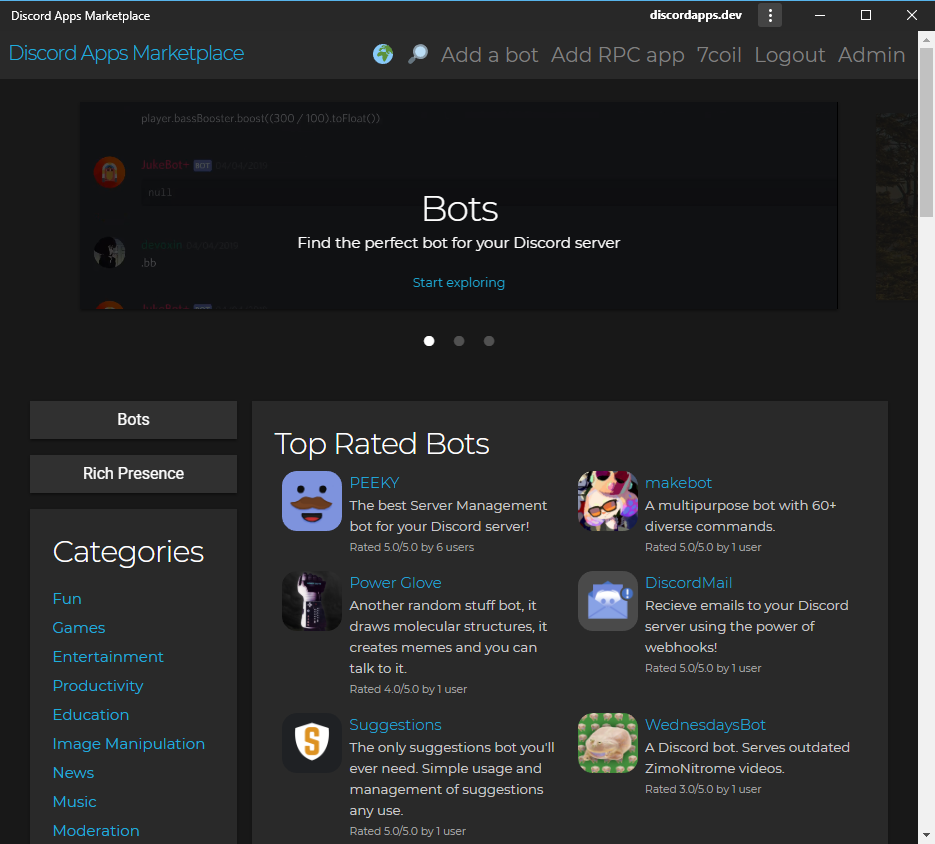

# Discord Apps Marketplace
_curated by Terminal.ink_

Discord Apps Marketplace is the next generation in Bot Listing technology,
utilising the latest web technology for the bot list of tomorrow.

## Features
### Progressive Web Application

Install Discord Apps Marketplace in supported Google Chrome browsers.
Service worker speeds up page loads for the fastest experience.

### Multi Language support

Present your ideas in more than just English.
Make your bot page in multiple languages to target many more users.

### Images, YouTube and YOUKU video embed

### Multi Prefix

Add multiple prefixes with available flags for if the bot can be mentioned or customised.

## Development Previews
Download the bundled code in the `dist` branch of this repo.

Location                                                          | Description
----------------------------------------------------------------- | -----------------
[Discord Apps Marketplace](https://discordapps.dev/)              | Production instance
[Netlify](https://twink.netlify.com/)                             | Development instance - Always latest commit
[GitHub Pages](https://terminal.github.io/discordapps.dev/)  | Development instance - Slower than Netlify
[Fog Creek Software's Glitch](https://discordapps-dev.glitch.me/) | Glitch is a great website
[Olivia Hye](https://www.youtube.com/watch?v=UkY8HvgvBJ8)         | Not related. Stan LOONA.

## Command Information
Command             | Description
------------------- | ---------------
yarn                | Download dependencies
yarn dev            | Run the development server
yarn create-bundles | Package the client-side and server-side portions for deployment
yarn start          | Run the production server

## Set up Development environment
[Refer to the "How to set up a development instance of Discord Apps Marketplace" page on discordapps.dev](https://discordapps.dev/en-GB/posts/docs/20190416-development-instance/)

<!--
## Sponsors
This project is funded by people who keep the open source community alive.
-->
