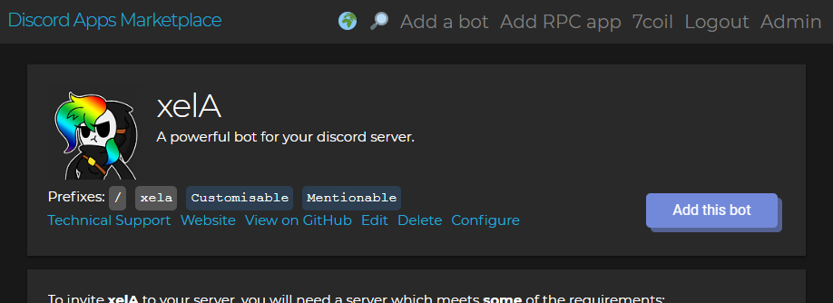

# Discord Apps Marketplace
_curated by Terminal.ink_

## Features
### Multi Language support

Present your ideas in more than just English.
Make your bot page in multiple languages to target many more users.

### Images, YouTube and YOUKU video embed


### Multi Prefix

Add multiple prefixes with available flags for if the bot can be mentioned or customised.

## Development Previews
Location                                                          | Description
----------------------------------------------------------------- | -----------------
[netlify](https://twink.netlify.com/)                             | In case you need the latest of the latest. You must always navigate back to `/` on refresh
[SSR Rendering](https://discordapps.dev/)                         | Server side rendered. Usually the newest.
[Fog Creek Software's Glitch](https://discordapps-dev.glitch.me/) | I'm not even going to be sorry for this.
[Olivia Hye](https://www.youtube.com/watch?v=UkY8HvgvBJ8)         | Not related. Stan LOONA.

## Command Information
Command            | Description
------------------ | ---------------
yarn               | Download dependencies
yarn start         | Run the development server
yarn build         | Build a version of Discord Apps Marketplace
yarn test          | Test (there are no tests written)
yarn eject         | Eject from `create-react-app`. Don't do this.
yarn webpack       | Pack the built version for use on the server. You must run `yarn build` before running
yarn server        | Run the production server. You must run `yarn build` then `yarn webpack` before running

## Set up Development environment
**You will need:**
- Node.js
- Build tools
  - Ubuntu: `sudo apt install build-essential`
  - Windows: (as admin) `npm i -g windows-build-tools`
- Yarn
  - Ubuntu: `sudo npm i -g yarn`
  - Windows: (as admin) `npm i -g yarn`

**For building a server environment:**
- Webpack
  - Ubuntu: `sudo npm i -g webpack-cli`
  - Windows: (as admin) `npm i -g webpack-cli`

```bash
// Clone the project
git clone --recursive-submodules -j8 https://github.com/terminal/discordapps.dev.git

// Install dependencies
yarn

// Start the project
yarn start
```

<!--
## Sponsors
This project is funded by people who keep the open source community alive.
-->
