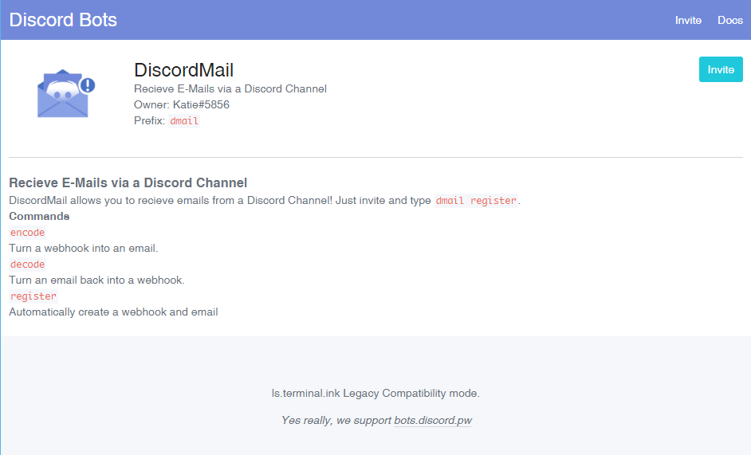
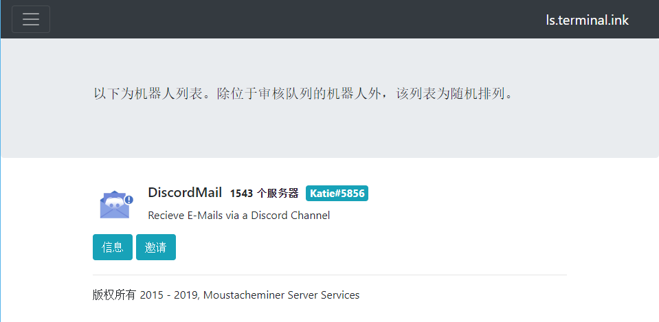
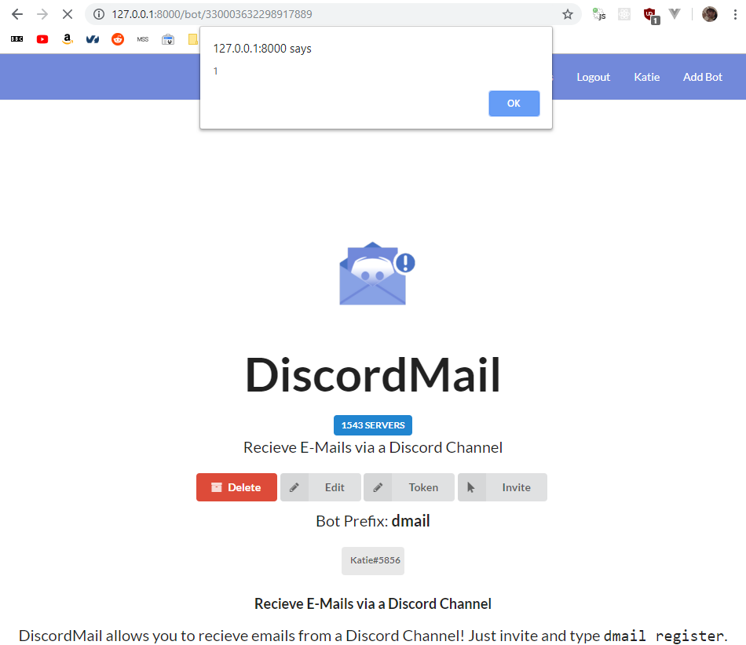
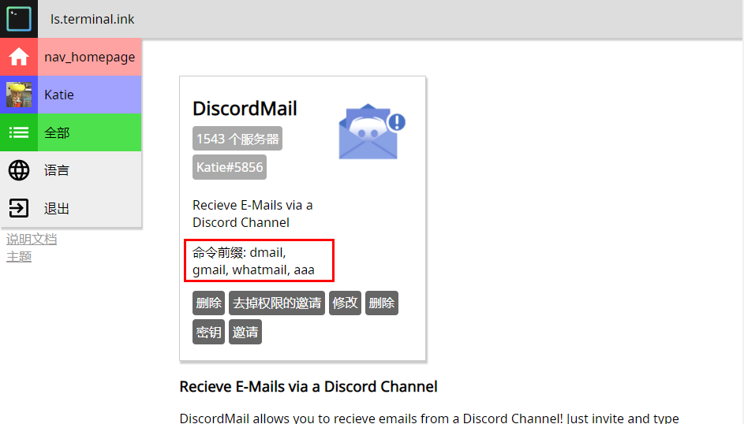

# Discord Apps
_curated by Terminal.ink_

ls.terminal.ink was a legacy in Bot Listing technology,
abusing the latest web technology for the bot list of yesterday.

## Features
### Interoperable Bot Pages
  
Make your legacy bot pages work with `ls.terminal.ink` to spend less time rewriting

### Multi Language support

Present your ideas in other languages other than English. Make your bot page in a different language to target much less users.

### Images, YouTube and YOUKU video embed

Your description is your gateway to XSS vulnerabilities

### Multi Prefix

Comma separated values count as multiple prefixes.  
Add the word `(mentionable)` in French and nobody will know if it means anything!

## Development Previews
Location                                                          | Description
----------------------------------------------------------------- | -----------------
&nbsp;                                                            | &nbsp;

## Command Information
Command            | Description
------------------ | ---------------
yarn               | Download dependencies
yarn start         | Run the server
