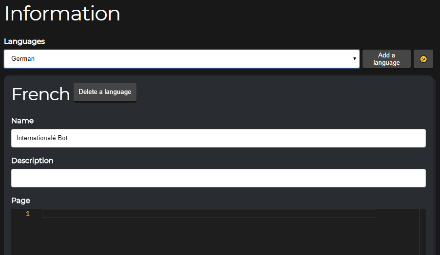
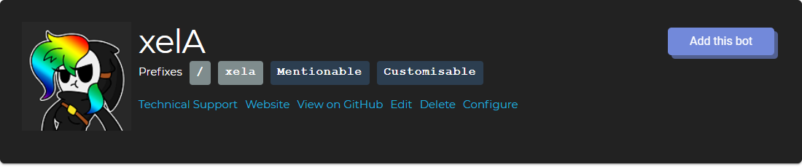

## Features
### Multilanguage support

Present your ideas in more than just English

### Multiprefix

Show how to trigger your bot, without the annoying guesswork of how to separate your multiple prefixes, and with tickboxes for "customisable" and "mentionable"

## Development Team
Category            | People
------------------- | --------------------------
Lead Developer      | 7coil#3175 ([@lepon01](https://github.com/lepon01))
Secondary Developer | Devoxin#0387 ([@Devoxin](https://github.com/Devoxin))

## Deployment
Setup will take about 12 hours.
<!-- Of course not. -->

1. Add your config into the configuration JSON, based on the `config.json` file
2. Run RethinkDB
3. From the root folder, run `node .\website\`

## Licence
All files (except the exceptions below) are licenced under the GNU Affero General Public Licence.

For licencing without the GNU AGPL, contact `7coil#3175` or email at `admin@moustacheminer.com`

### Exceptions
- `/website/www-root/js/modalPerms.js` is licenced under the MIT licence.
- `/website/class/ImageCache.js` is licenced under the MIT licence.

## Versions
This is Version 10 of ls.terminal.ink.

- [Version 1 (unsupported)](https://github.com/Terminal/ls.terminal.ink/tree/archive-pugjs)
- [Version 2 (failure)](https://github.com/Terminal/ls.terminal.ink/tree/archive-kotlin)
- [Version 3 (failure)](https://github.com/Terminal/ls.terminal.ink/tree/archive-react)
  - [Frontend](https://github.com/Terminal/ls-v2-frontend)
- [Version 4 (unsupported)](https://github.com/Terminal/Discord_Fork/tree/v1)
  - Forked with permission from AlexFlipnote
- [Version 5 (failure)](https://github.com/Terminal/ls.terminal.ink/tree/archive-nextjs)
- [Version 6 (failure)](https://github.com/Terminal/ls.terminal.ink/tree/archive-circuitrcay)
- [Version 7 (latest)](https://github.com/Terminal/Discord_Fork)
- Version 8 and 8.1 is not available for download
- Version 10 (development)

---
# Selling Out
This website is sponsored by "every other fork of ls.terminal.ink"

_"Get that refreshing taste of profiting on work while not attributing the original author"_ - Anonymous Whale
