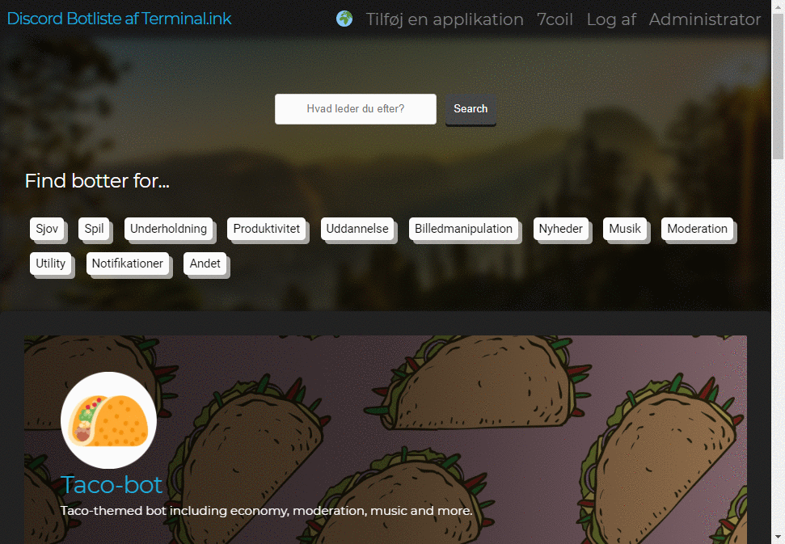

- [Website](website)
- [React Frontend Rewrite](frontend)
- [Image Proxy Server](proxy)
- [Discord Bot](bot)

## Features
### Multilanguage support

Present your ideas in more than just English.
Make your bot page in multiple languages to target many more users.

### Images, YouTube and YOUKU video embed

Embed demonstration images and videos for your bot to reduce technical support calls for your bot.

### Multiprefix

Add multiple prefixes with available flags for if the bot can be mentioned or customised.

## Dependencies
- [View `npm` dependencies](https://github.com/Terminal/ls.terminal.ink/network/dependencies)
